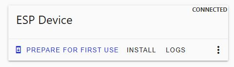
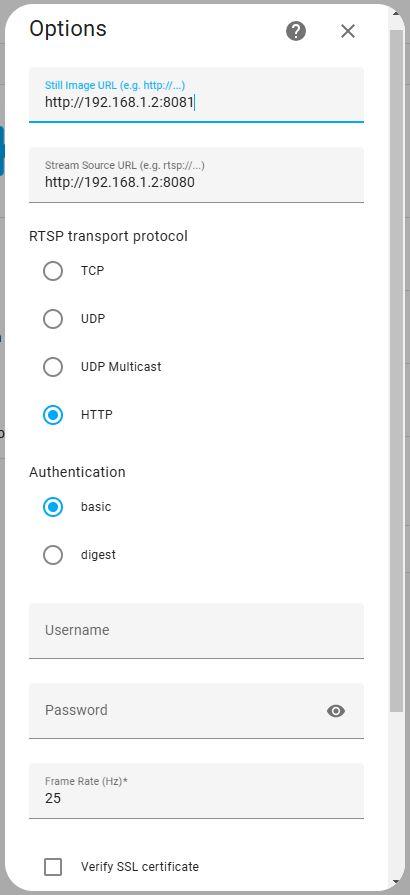

## ESP32-cam

### Software

If adding an esp32 camera, it has no rtsp stream and needs to be added in special way using http. (Assuming standard esp32 cam config).

### Config

First lets install "ESPHome Device Builder" Add-on for Home Assistant. [Official guide](https://esphome.io/guides/getting_started_hassio/) Then simply create an empty device selecting esp2 type. Once done, it will appear in the webpage, In my case I want to configure the cams with the following options:

- Hostname different for each cam, this example is cam2
- Static ip address in order to keep some order in my LAN as I have different segments for each type of device
- A fallback hotspot so in case the esp32-cam is not able to connect to my wifi it will generate a hotspot and I can connect to that in order to repair the cam config. The only presence of a esp32-cam* hostspot will let me know something is not properly working.
- Web server with basic info in port 80
- Streaming realtime server in port 8080
- Snapshot server in port 8081
- Sensor for wifi signal strenght
- Sensor for uptime
- Button to start the embeded light.

Select edit and paste something like the following:

```
esphome:
  name: esp32-cam2
  friendly_name: ESP32-CAM2

esp32:
  board: esp32dev
  framework:
    type: arduino

# Enable logging
logger:

# Enable Home Assistant API
api:
  encryption:
    key: "F75g5jG//E+BZ+m+BRpoD/rbX4bdu3aPzqpmvs6r807="

ota:
  - platform: esphome
    password: "88d248a4ad16c1358825fd22d38bbd37"

wifi:
  ssid: !secret wifi_ssid
  password: !secret wifi_password

  # Optional manual IP
  manual_ip:
    static_ip: 192.168.1.2
    gateway: 192.168.1.1
    subnet: 255.255.255.0

  # Enable fallback hotspot (captive portal) in case wifi connection fails
  ap:
    ssid: "esp32-cam2"
    password: "esp32-cam2"

web_server:
  port: 80

captive_portal:

esp32_camera:
  external_clock:
    pin: GPIO0
    frequency: 20MHz
  i2c_pins:
    sda: GPIO26
    scl: GPIO27
  data_pins: [GPIO5, GPIO18, GPIO19, GPIO21, GPIO36, GPIO39, GPIO34, GPIO35]
  vsync_pin: GPIO25
  href_pin: GPIO23
  pixel_clock_pin: GPIO22
  power_down_pin: GPIO32
  vertical_flip: False
  horizontal_mirror: False

  # Image settings
  name: ESP CAM
  resolution: 800X600

sensor:
  - platform: wifi_signal
    name: "WiFi Signal Sensor"
    update_interval: 2s
  - platform: uptime
    name: Uptime Sensor

esp32_camera_web_server:
  - port: 8080
    mode: stream
  - port: 8081
    mode: snapshot

# Flashlight
output:
  - platform: gpio
    pin: GPIO4
    id: gpio_4

## GPIO_4 is the flash light pin
light:
  - platform: binary
    output: gpio_4
    name: flashlight
```
If you dont feel comfortable inventing the part about
```
api:
  encryption:
    key: "F75g5jG//E+BZ+m+BRpoD/rbX4bdu3aPzqpmvs6r807="

ota:
  - platform: esphome
    password: "88d248a4ad16c1358825fd22d38bbd37"
```
You can copy it from the original device created.

On the top right of the webpage a link called "Secrets" should appear. It's used to store there the SSID and the password of the wifi instead of storing them in the main config files. You should edit this and be sure that the informations stored is the right one.
```
# Your Wi-Fi SSID and password
wifi_ssid: "MyRealWifiSSID"
wifi_password: "MyUltraSecretPassword"
```
Config done! 

### ESP32-CAM FW build

Now click on the three dots in the device, and select install. It's a must for the first time to select the manual download option. It's going to start with the compilation of the firmware for your esp32-cam device (it can take up to 10 minuts depending on yur hardware, but you can see it working in real time). Once it finish we are going to download it in factory format. 

Firmware done! Lets keep this file in a safe place. I call it "esp32-cam2.factory.bin". 

### ESP32-CAM FW install

Lets connect your esp32-cam to your computer with a data USB cable, WITH A DATA USB CABLE! You have to be sure that the USB cable is able to send data not only power. Now, lets open [](https://web.esphome.io/) . We are going to click on the "Connect button", the select the port and this will appear. 

.

First of all we are going to "Prepare for first use", and wait until it ends. Then click "Install" and select the "esp32-cam2.factory.bin" file. Firmware installed.

### ESP32-CAM start and monitor

Click "Logs" and "Reset device" something like this should appear:

```
[18:27:55]ets Jul 29 2019 12:21:46
(...)
[18:27:56][C][component:163]: Setup esp32_camera took 214ms
(...)
[18:28:07][D][wifi:576]: Found networks:
[18:28:07][I][wifi:599]: - 'MyRealWifiSSID' [redacted]▂▄▆█          <----- YOUR WIFI NETWORK IS DETECTED
[18:28:07][D][wifi:601]:     Channel: 11
[18:28:07][D][wifi:601]:    RSSI: -67 dB
(...)
[18:28:07][I][wifi:329]: Connecting to 'MyRealWifiSSID'
[18:28:07][I][wifi:675]: Connected                                   <----- YOU ARE CONNECTED TO YOUR WIFI NETWORK
[18:28:07][C][wifi:444]:   Local MAC: CA:FE:CA:FE:CA:FE
[18:28:07][C][wifi:449]:   SSID: [redacted]
[18:28:07][C][wifi:452]:   IP Address: 192.168.1.2                   <----- YOUR IP
[18:28:07][C][wifi:456]:   BSSID: [redacted]
[18:28:07][C][wifi:456]:  Hostname: 'esp32-cam2'                     <----- YOUR HOSTNAME
[18:28:07][C][wifi:456]:  Signal strength: -66 dB ▂▄▆█             <----- SIGNAL STRENGHT
[18:28:07][C][wifi:467]:   Channel: 11
[18:28:07][C][wifi:467]:  Subnet: 255.255.255.0
[18:28:07][C][wifi:467]:  Gateway: 192.168.1.1
[18:28:07][C][wifi:467]:  DNS1: 0.0.0.0
[18:28:07][C][wifi:467]:  DNS2: 0.0.0.0
(...)
[18:28:08][C][captive_portal:122]: Captive Portal:
[18:28:08][C][web_server:309]: Web Server:
[18:28:08][C][web_server:309]:  Address: 192.168.1.2:80               <----- STANDARD WEBPAGE
(...)
[18:28:08][C][esp32_camera_web_server:088]: ESP32 Camera Web Server:
[18:28:08][C][esp32_camera_web_server:088]:  Port: 8080               <----- STREAM PORT
[18:28:08][C][esp32_camera_web_server:093]:   Mode: stream
[18:28:08][C][esp32_camera_web_server:088]: ESP32 Camera Web Server:
[18:28:08][C][esp32_camera_web_server:088]:  Port: 8081               <----- SNAP PORT
(...)
```

### ESP32-CAM Home assistant config

To add them to home assistant, just use the following example:

.
